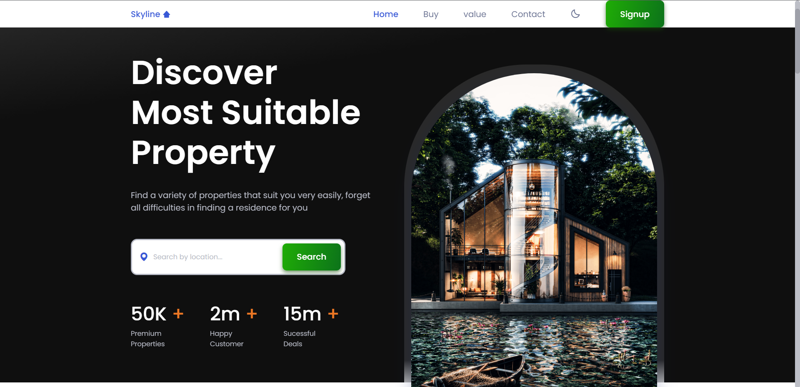
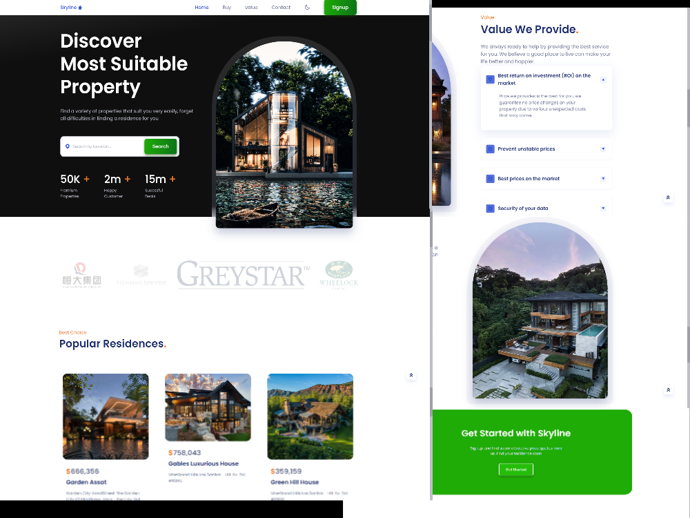
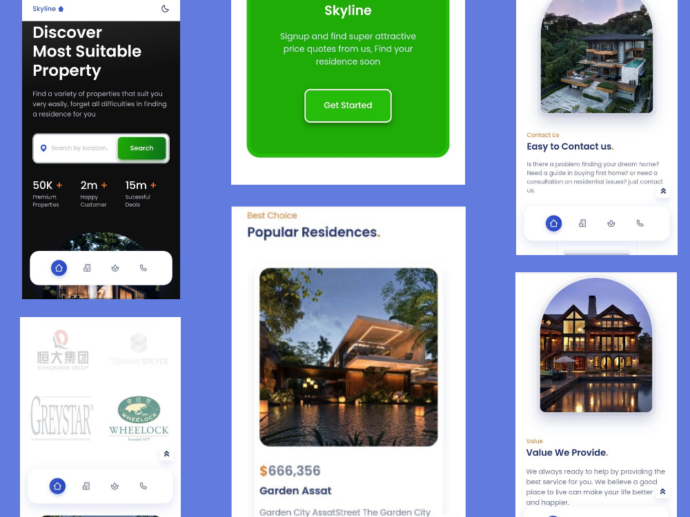

<div></div>

<br><br>

[](https://www.linkedin.com/in/darkz1177/)

<br>

# About

A Responsive Website Built using HTML, CSS and Javascript.

<br>
<br>

# Table of Contents
- [Demo](#Demo)
- [Features](#Features)
- [Installation](#Installation)
- [Tech-Stack](#Tech-Stack)
- [Project-References](#References)

<br>
<br>

# Demo




<br>
<br>

# Features

- **Responsive** and aligned.
- Contains custom scroll bar.
- It has Four color designs (Black(`#000000`), White(`#FFFFFF`), Green(`#0c731a`), Blue(`#627bdf`))
- Smooth scrolling in each section with **animated navbar**.
- It has a custom Scrollreveal animation using JS.
- Compatible with all mobile devices and with a beautiful and pleasant user interface.

<br>
<br>

# Installation

To install **Skyline-Estates**, follow these steps:

> [Fork the repository](https://github.com/DaRkZ1177/Skyline-Realestate-Website/fork) 

Linux and macOS:

```bash
sudo git clone https://github.com/DaRkZ1177/Skyline-Realestate-Website.git
```

Windows:

```bash
git clone https://github.com/DaRkZ1177/Skyline-Realestate-Website.git
```

<br>
<br>

# Tech-Stack

- <div><a href="https://www.w3.org/html/" target="_blank">HTML 5.0  </a></div>

- <div><a href="https://www.w3schools.com/css/" target="_blank"> CSS  </a>

- <div><a href="https://developer.mozilla.org/en-US/docs/Web/JavaScript" target="_blank"> JS  </a></div>

<br>
<br>

# References

| Name | Link |
| --- | ---|
| W3C School | https://www.w3schools.com |
| Bootstrap | https://getbootstrap.com |
| Stack Overflow | https://stackoverflow.com |
| Github | https://github.com |
